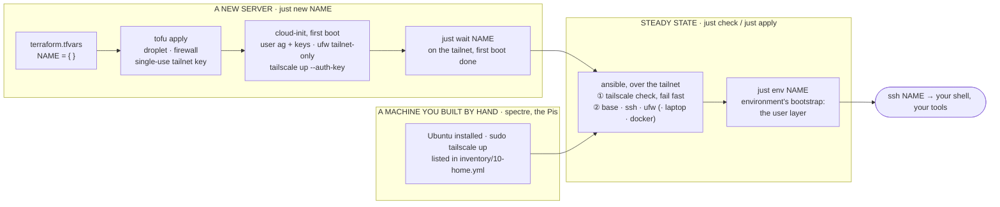

# fleet

What makes a machine a server: what exists (terraform), how it is born
(cloud-init), how it stays configured (ansible), and the tailnet policy
that ties them together. What makes a machine *mine* (shell, editor,
dotfiles, `ssh <name>`) is [`environment`](https://github.com/agosmou/environment),
which this repository hands off to as its last step. Facts about the house
(subnets, addresses, switch ports) are the private `home-network`
repository's; this one reads a single value from it through a gitignored
file, which is what lets it be public.

Machines: `spectre` (HP laptop, Ubuntu Server, at home), droplets on
DigitalOcean named in `terraform/digitalocean/terraform.tfvars`, and soon
two Raspberry Pis. Every one is reached by its tailnet name; no IP appears
in a command. New to any of this? Read [`docs/tour.md`](docs/tour.md): every
file, what it is for, when it runs, and where to read more.

## How it works

Two ways a machine enters the fleet, one steady state for both:



The rule that keeps the layers apart: **cloud-init runs once and contains
only what ansible needs to reach the box.** Anything you would want to
change later goes in an ansible role, where `just check` shows the diff
before `just apply`. Terraform only ever answers "what exists".

Tailscale is the one thing every layer touches, so its ownership is
explicit: **the tool that had to install it owns it.** On servers that is
cloud-init (nothing can reach the box before it); ansible only checks
(`BackendState == Running`, right node name, key expiry); environment only
asserts the daemon is up. On the Fedora laptop and the Mac, environment
installs it because nothing else is there to.

## Layout

```
justfile                  the UX; `just` lists it
flake.nix  .envrc         tools (tofu, ansible, doctl, cloud-init, jq) via direnv
secrets.env.example       tokens; copy to secrets.env, which is gitignored
TODO.md                   what is next, in order

terraform/digitalocean/   EXISTENCE  droplets + provider firewall; the tailnet
  terraform.tfvars                   policy (tailscale.tf, policy.hujson) and a
  policy.hujson                      single-use birth key per droplet; writes
                                     ansible/inventory/20-vps.yml
cloud-init/               BIRTH      base.yaml.tftpl: user, keys, ufw,
  authorized_keys                    tailscale up. Only what ansible needs
ansible/                  STEADY     roles: base ssh ufw laptop docker, after
  inventory/10-home.yml              the tailscale check (pre_tasks, fails fast)
  inventory/00-local.yml             gitignored: LAN facts, from home-network
  inventory/20-vps.yml               terraform-written: the droplets
  inventory/group_vars/all.yml       defaults for every machine
  playbooks/site.yml                 groups → roles
docs/tour.md              every file explained, with where to read more
```

## How a server is born

| Machine | Exists because | cloud-init arrives via | Joins the tailnet by |
|---|---|---|---|
| droplets | `terraform.tfvars` | DO user-data | single-use `tag:server` key minted by terraform |
| Pi 4, Pi Zero 2 W | bought | `user-data` on the SD card's `system-boot` | single-use key from `just key <name>` |
| spectre | owned | none yet (autoinstall USB, if ever reinstalled) | by hand, `sudo tailscale up`; untagged, so its key expires |

## Setup, once per workstation

```sh
git clone git@github.com:agosmou/fleet.git ~/fleet && cd ~/fleet
cp secrets.env.example secrets.env         # DO token, Tailscale OAuth client, password hash
cp ansible/00-local.yml.example ansible/inventory/00-local.yml   # LAN subnet, from home-network
direnv allow                               # loads the tools and the secrets on cd; again whenever .envrc changes
just lint                                  # everything parses; renders the cloud-init and schema-checks it
just acl-pull                              # live tailnet policy → policy.hujson, imported; first plan is empty
```

The three secrets and where they come from are described in
`secrets.env.example`. Keep a copy in a Bitwarden secure note named
`fleet secrets.env`; a new workstation is then a paste.

## Usage

```sh
just                    # list recipes

# a new server
just new do1            # birth to ready: up → wait → apply -l do1 → env do1  (~10 min; see TODO 1 and 2 for the prompts and the time)
just status do1         # cloud-init and tailscale state
ssh do1                 # MagicDNS; the same user name on both ends, so no ssh config needed
just down               # destroy every droplet (asks); then:
just forget do1         # remove its tailnet node and local ssh host key, so the next do1 is not do1-1
just rebirth do1        # forget + replace key and droplet with the current cloud-init

# the steady state, any machine
just online             # which inventory hosts are on the tailnet right now, no ssh
just check              # online, then a dry run with diff, every host
just check -l spectre   # one host
just apply -l spectre   # converge it
just env spectre        # user layer: environment's bootstrap, --target server

# the tailnet
just key pi4            # single-use tag:server birth key for a machine terraform does not create
just plan               # what `just up` would change, droplets and policy alike
```

Adding a droplet: a line in `terraform.tfvars`, `just new <name>`.
Removing one: delete the line, `just up`, `just forget <name>`.

## Roles

| Role        | Effect |
|-------------|--------|
| `tailscale` | Check only, first: connected (`Running`), online, node name is the inventory name, warns 30 days before an untagged key expires. Installs nothing: see "How a server is born" |
| `base`      | Passwordless sudo for ag (the ssh key is the credential; validated with `visudo`), baseline packages, unattended security upgrades, auto-reboot at 04:00 only when a kernel update requires it, a 2 GB swapfile where a machine has none |
| `ssh`       | Keys only, no root, only listed users, no X11/agent forwarding, idle sessions dropped; validated with `sshd -t` before it is written, reloaded not restarted |
| `ufw`       | Default deny inbound. Allowed: anything over `tailscale0`, Tailscale's WireGuard port, and SSH from `lan_cidr` where a host defines one |
| `laptop`    | Lid closed and idle never suspend; sleep targets masked. Group `laptops` only |
| `docker`    | Docker CE from Docker's apt repository, compose and buildx, `ag` in the `docker` group, unattended-upgrades patches it. Published ports bind to loopback by default and a `DOCKER-USER` chain drops what does not arrive over `lo`, `tailscale0` or a bridge, so a container is never on the LAN or the internet by accident. Group `containers` only |

## Containers

`docker` and `docker compose` behave the same on every machine; only the
install differs by who owns root there. Servers: this repository, group
`containers` (spectre today; a droplet joins by being listed in
`inventory/10-home.yml`). The Mac: Docker Desktop, from environment's
Brewfile. The Fedora laptop: podman, with the switch to Docker written
down in environment's `docs/containers.md`.

The rule on a server, because Docker publishes ports with NAT rules that
run before ufw sees the packet: **a published port is loopback unless you
say otherwise**. `ports: ["5173:5173"]` in a compose file lands on
`127.0.0.1:5173`; reach it from the tailnet with `tailscale serve 5173`
(environment's `docs/remote-dev.md`). To listen on the tailnet directly,
write the address: `100.x.y.z:5173:5173`. The `DOCKER-USER` chain drops
anything else even if a file says `0.0.0.0`.

## Lockout safety

- Provider firewall admits nothing inbound but Tailscale's UDP port, so a
  droplet whose `ufw` failed still exposes nothing; DigitalOcean's web
  console (password from `secrets.env`) is the fallback.
- The SSH drop-in is validated with `sshd -t` before it is written, and
  `ssh` is only reloaded (existing sessions survive). Handlers run even if a
  later task fails, so a written drop-in is never left unloaded.
- Firewall rules are added before `ufw` is enabled.
- Always test a **new** SSH connection before closing the one you're in.
- `spectre` keeps its LAN SSH rule (`lan_cidr`, from `00-local.yml`) as the
  fallback for when Tailscale is down; keyboard and monitor on the box is
  the last resort.

## Secrets

`secrets.env` (gitignored) holds the DO token, the Tailscale OAuth client
and the password hash; nothing else here is secret. Terraform state
(gitignored) contains the birth keys and rendered user-data; treat
`.tfstate` like a key. Each droplet's user-data also holds its birth key,
readable from the metadata service by any local user, but the key is
single-use and spent at first boot, so that copy is worthless. The OAuth
client is the credential that matters.

Nothing about the house is here either: subnets, addresses, MACs and
switch ports live in the private home-network repository and reach ansible
only through the gitignored `inventory/00-local.yml`.
